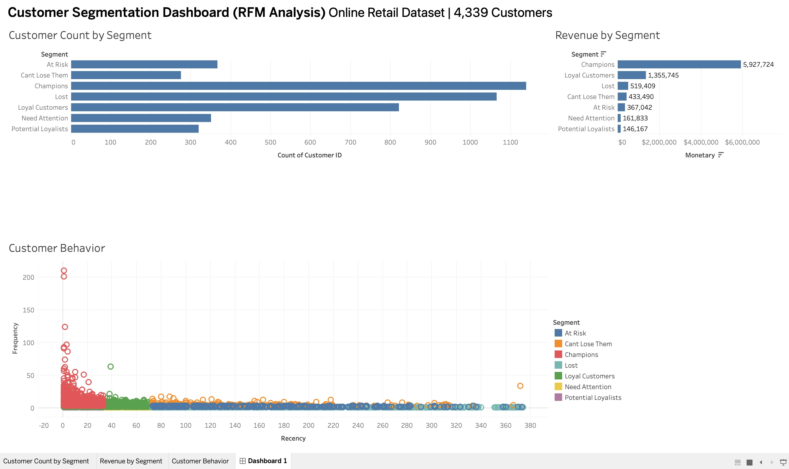
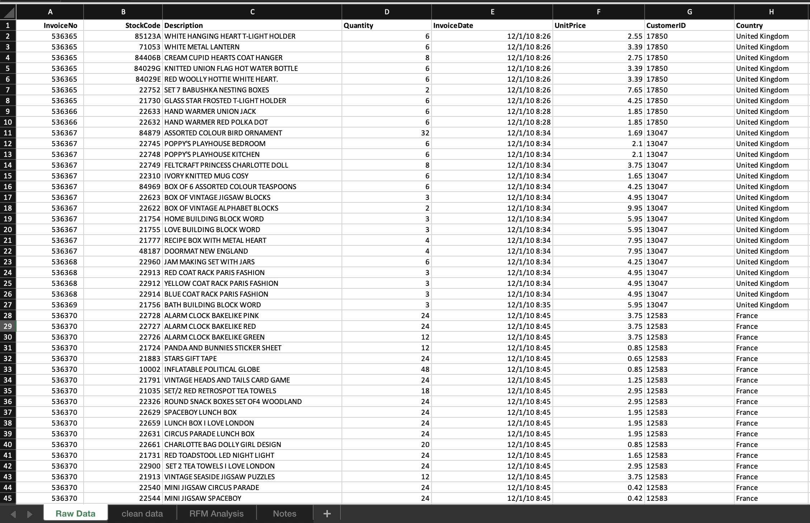

# Customer Segmentation using RFM Analysis

This project performs customer segmentation on an online retail dataset using RFM (Recency, Frequency, Monetary) analysis.

## Dataset
- Source: Online Retail Dataset
- Total Customers: 4,339
- Each record represents a customer transaction.

## Data & Files
- Raw dataset: `Online Retail.xlsx`
- Cleaned results: `RFM_Analysis_Results.xlsx`

## Raw Data (Excel)

## Data Cleaning
The following steps were performed:
- Removed rows with missing Customer IDs
- Removed cancelled orders (negative quantities)
- Converted InvoiceDate to datetime format
- Removed duplicate records
- Calculated total monetary value per customer

## RFM Metrics
For each customer:
- Recency: Days since last purchase
- Frequency: Number of transactions
- Monetary: Total amount spent

## Segments
Customers were grouped into:
- Champions  
- Loyal Customers  
- Potential Loyalists  
- Need Attention  
- At Risk  
- Can't Lose Them  
- Lost  

## Tools Used
- Python (Pandas, NumPy)
- Tableau (Dashboard visualization)
- GitHub (Version control)

## Output
- Tableau Dashboard: `RFM.twb`
- Cleaned Results: `RFM_Analysis_Results.xlsx`
- Python Script: `rfm_analysis.py`
